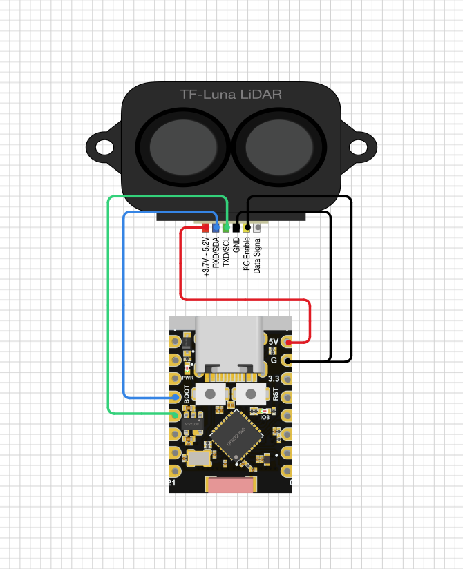

# ESP32 C2 TF-Luna I2C Sync Example

The structure of this example was generated using esp-generate version 0.5.0

## Quick start

- Connect the TF-Luna to the ESP32 C3 board:

  

- Make sure you have installed the pre-requisites for cross-compiling and flashing the ESP32.

- Run:

  ```shell
  cargo run
  ```
